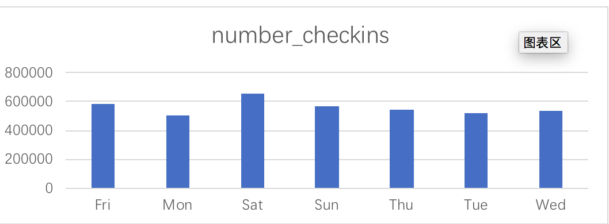
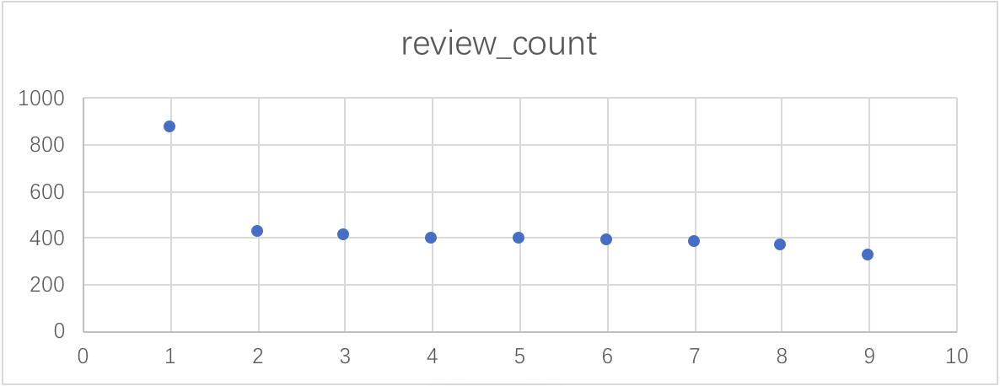
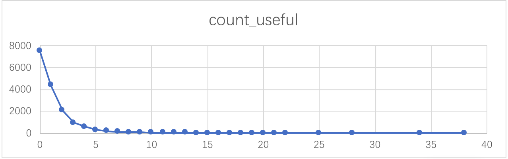
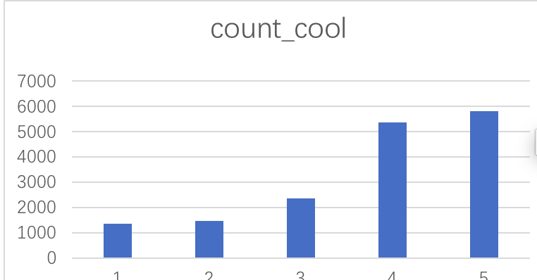

# ica4
USF projects for the SQL questins
## Description of datasets.yelp_reviews
describe the reviews of business with stars and labels by users.
## Description of datasets.yelp_checkin
describe the business through weekday and hours' checkins.
## Description of datasets.yelp_user
describe how users evaluate a business with their evaluation labels.

## Question #1
1.	How many restaurants with stars?

```sql
SELECT stars, count(business_name) as number_restaurants
FROM yingjin.yelp_reviews 
WHERE stars <> '?'
group BY 1
ORDER BY stars
```


## Question #2
2.	How many check-ins during Monday to Friday?

```sql
SELECT weekday, count(checkins) as number_checkins
FROM datasets.yelp_checkin
group BY 1
ORDER BY weekday
```



## Question #3
3.	Count during January 2016 the amount of reviews of users reviews above 300? 

```sql
SELECT name, review_count
FROM datasets.yelp_user
where yelping_since between '2016-01-01' and '2016-01-31' 
and review_count > 300
group BY 1,2
ORDER BY review_count DESC
```


## Question #4
4.	  What’s the useful reviews in times?

```sql
SELECT useful, count(review_id) as count_useful
FROM datasets.yelp_reviews
group BY 1
ORDER BY useful
```

## Question #5
5.	How many cool reviews for the business with stars?
```sql
SELECT stars, count(cool) as count_cool
FROM datasets.yelp_reviews
group BY 1
ORDER BY stars
```


