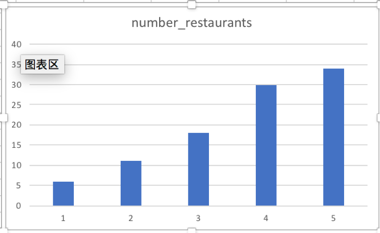

# ica4
USF projects for the SQL questins
## Description of datasets.yingjin.yelp_reviews


## Question #1
1.	How many restaurants with stars?

```sql
SELECT stars, count(business_name) as number_restaurants
FROM yingjin.yelp_reviews 
WHERE stars <> '?'
group BY 1
ORDER BY stars
```


